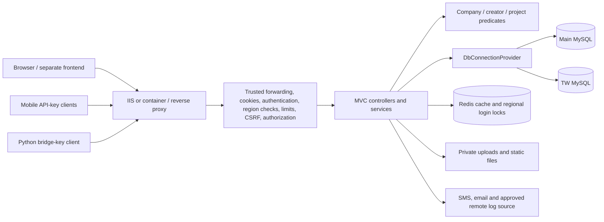

# Signal Tracker security hardening and VAPT handover

Review date: 2026-09-21. Starting commit: `c33141f`. Changes are local and uncommitted; the running app has not been restarted or deployed. This report records the implemented work and remaining gates. **A complete VAPT assessment has not been performed.**

## Deliverables

- [Endpoint inventory](endpoint-inventory.csv): 291 MVC route descriptors across 23 controllers, including aliases and partial controllers. A descriptor may list multiple methods; static files, middleware rewrites and external services are outside the inventory.
- [Findings tracker](findings.csv): 17 tracked findings/review areas with status, evidence, provisional severity, owner and completion criteria. Severity is not a CVSS assessment or a claim of live exploitability.
- [Deployment checklist](DEPLOYMENT.md): required settings, expected behavior changes, staging tests and external work.
- [Pending proposals](proposals/README.md): review-only default-authentication and CSRF migration patches. Automatic approval review rejected application of both broad changes because exception coverage/client compatibility is not verified. Neither is in the running implementation.
- `scripts/vapt-baseline.ps1`: repeatable isolated build, security/CSV/diagnostic regressions and optional dependency audit.

## Architecture observed



The project targets .NET 8; local SDK is 8.0.416. It uses EF Core/Pomelo, Dapper, MySqlConnector/MySql.Data, Redis and CsvHelper. IIS and Docker configuration exist; the actual production topology is unverified. Browser authentication uses cookies intended for cross-site frontend access. Existing numeric user types are ordinary user=1, company admin=2 and super-admin=3.

Health/mobile routes use PublicApiKey, PythonBridge uses its own action filter, and data deletion uses OTP/deletion tokens. Fifty-two route descriptors lack standard Authorize/AllowAnonymous metadata; this is **not** fifty-two confirmed anonymous vulnerabilities. The pending fallback-policy proposal makes these contracts explicit. Every inventory OwnershipReview cell remains unverified at the deployed endpoint level, even where local predicate tests now pass.

## Implemented changes

1. Restricted global Redis operations, arbitrary-user password reset, and inspected legacy account mutations to SuperAdmin. Company-user creation requires CompanyAdmin, defaults to ordinary user, and rejects elevated roles from company admins. Inspected company account mutations cannot target administrator accounts; license mutations require SuperAdmin. Removed recovery identifiers/tokens from reviewed admin projections.
2. Indoor plans require login and company/creator scope. The model already has creator fields; new plans now populate them. Legacy null-creator plans are super-admin-only pending explicit assignment. No new database column was introduced for this change.
3. Shared project predicates protect the reviewed site-prediction list/import/scenario/delete paths, including the alternate map CSV upload. Supplied upload-history IDs are scoped. Site listing take is capped at 1000.
4. Ordinary users are bound to signed regional identity. Conflicting query/header overrides are denied; ordinary users cannot use the inspected clutter and legacy-admin cross-database fallbacks. Login locks and user rate-limit partitions include region.
5. Cookies have default 30-minute idle and 1-day absolute lifetimes. Per-request validation checks the active database user, credential version, role/company and regional Redis lock. Production requires Redis and rejects unavailable/missing/changed validation state. Old cookies lack the new credential/start properties and must sign in again after deployment. Datastore-backed behavior and performance still require staging verification.
6. Password recovery uses protected 15-minute tokens and a configured HTTPS link origin. Recovery identifiers are consumed with an atomic update; blank CAPTCHA is rejected and the hardcoded alternate recipient is removed. Existing unsigned reset links become invalid.
7. Cookie settings preserve Secure and trust only the effective request scheme after configured proxy forwarding. Forwarded headers run before HSTS; user rate limiting runs after authentication.
8. Log proxy requires login, rate limiting and an exact stored URL on an accessible project (super-admin remains privileged). It rejects unapproved URL forms, follows no redirects, returns generic upstream errors, and bounds transfers to 500 MiB and two minutes. Legacy links without a project association need explicit assignment.
9. CSV headers are read with a 65,536-character bound. Site ZIP validation caps entries at 1000 and declared total extracted size at 500 MiB. ProcessCSV's private synchronous staging copy is removed after processing; other upload/row/query paths still need workload review.
10. Preserved missing local development secrets in the existing .NET User Secrets file and cleared five tracked DB/Redis/SMS/bridge configuration values. Sanitized tracked login/cookie artifacts and removed literal credential examples from the old precheck. History and actual server credentials are unchanged and require coordinated rotation/review.
11. Automatic startup schema helpers now require Development plus explicit opt-in. Other service-level schema helpers still require migration review before claiming runtime least privilege.

## Verification completed

The isolated build and latest regression suite pass. See ignored logs under `artifacts/vapt-baseline`.

- 96 route/identity authorization cases: anonymous, ordinary user, company admin and super-admin on the changed guarded routes.
- Two-company, creator, orphan-record and companyless resource predicates; provider SQL translation checked without opening a connection.
- IN/TW query/header tampering, legacy-admin routing and regional login-key isolation.
- Credential changes, account deactivation, role changes and absolute session expiry.
- Valid, tampered, expired and legacy unsigned password-reset tokens; company-admin super-admin-creation attempt rejected before database access.
- Cookie Secure behavior and actual trusted/untrusted forwarded-header middleware.
- Diagnostic time index: 1,061 comparisons, including midnight wraparound, missing times, session isolation and duplicate timestamps.
- Site CSV required/optional headers, mapping, invalid-header responses and ZIP validation, plus oversized-header and archive-entry-count bounds.
- Allowed/disallowed download URL shapes; full upstream streaming and resource lookup require staging.
- NuGet vulnerability audit of direct/transitive packages: configured NuGet source reported none. This does not audit OS/runtime/container patches, vendored JS or unpublished vulnerabilities.

Run from the repository root:

```powershell
./scripts/vapt-baseline.ps1
```

Use `-SkipDependencyAudit` only when unchanged dependency results are already recorded. The script builds to isolated output and does not start the application. The inventory uses MVC action descriptors without executing application startup, hosted services or controller/database operations. Package-list commands may exit zero when findings exist; inspect the report.

## Completion gates still open

1. Approval and compatibility testing for both [prepared proposals](proposals/README.md). The current custom CSRF implementation and no-fallback behavior remain active.
2. Production secret injection, rotation of exposed DB/Redis/SMS/bridge credentials, session invalidation, and coordinated Git-history cleanup. Current validity was not tested.
3. Actual frontend/staging access, synthetic accounts for two companies/regions and each role, and an agreed permitted test scope.
4. Live cookie/logout/reset/revocation and Redis outage tests, plus performance of per-request user validation. Logging in requires the new configuration and fresh cookies.
5. Full coverage of remaining controllers/services, body-driven region choices, machine identity contracts, raw SQL, output encoding, static files, upload rows/query limits and cache isolation. This source review does not claim coverage of all 291 route descriptors.
6. Full source/history secret and static analysis, vendored dependency review, infrastructure checks, authenticated dynamic testing and independent VAPT/retest. Gitleaks and Semgrep were not installed; neither scan was reported as completed.

No production traffic, database queries/mutations, credential-validity probes, Redis flushes or external active scans were performed. No credential values are included in these reports. The original sandbox runner failed; approved local work used the functioning elevated runner. The first default-output build encountered the running app's locked DLL; subsequent builds use isolated output.

## References

The proxy change follows [Microsoft's trusted-forwarding and HSTS ordering guidance](https://learn.microsoft.com/en-us/aspnet/core/host-and-deploy/proxy-load-balancer?view=aspnetcore-8.0). Resource and role controls follow [OWASP's per-request authorization guidance](https://cheatsheetseries.owasp.org/cheatsheets/Authorization_Cheat_Sheet.html). Evidence for the actual code changes and their limits is recorded above and in the findings tracker.
